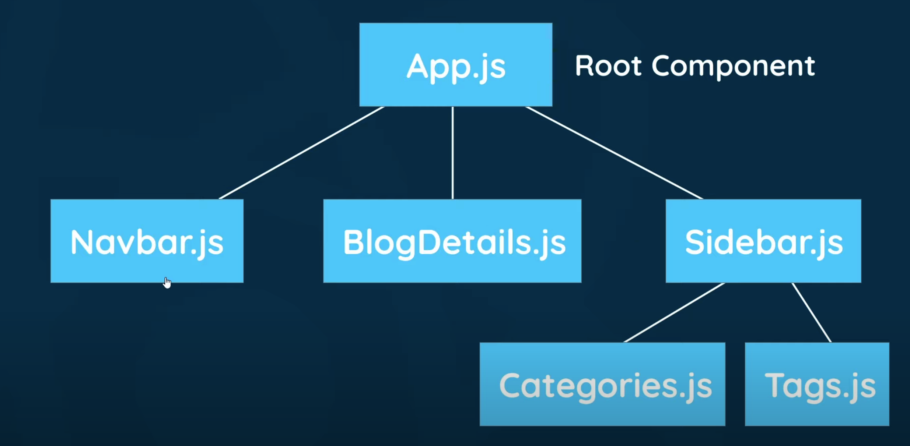

# React-Notes-2

# JSX

- The JSX acronym can stand for "JavaScript Syntax Extension", see: [reactenlightenment.com](https://www.reactenlightenment.com/react-jsx.html)

- JSX can also stand for "JavaScript XML", see [W3Schools](https://www.w3schools.com/react/react_jsx.asp#:~:text=JSX%20stands%20for%20JavaScript%20XML,to%20write%20HTML%20in%20React.)

- JSX mixes Javascript and what looks very similar to, but is not, HTML. 

- JSX can not be rendered directly to the browser and must be compiled (by [Babel](https://medium.com/swlh/the-role-of-babel-in-react-dbcf78c69125)) to JavaScript so that it runs in the browser.

- In HTML, elements can come as singleton tags without being self-closed, for example: the `input` element in HTML looks like this: `<input>`. There is no closing tag. However in JSX, any singlton element must be self-closed. If not, then an error will be generated. So the HTML `<input>` element must be written as `<input />` in JSX. It must end with the forward slash and closing angle bracket.

- This also applies to the image element which has to self-close as follows: ``

- JSX elements, though very similar to HTML elements, are actually JavaScript expressions. They can be passed to variables, i.e: `const navBar = <nav>This is a nav bar</nav>;`. In this example the entire line is a JavaScript expression.

---
# Attributes

- JSX elements can have attributes which are similat to the attributes of HTML elements. 

- There is a conceptual connection in the similarity of HTML attributes, and what are known as React "props" (properties). See [this article](https://sawyerh.medium.com/how-react-props-relate-to-html-attributes-and-js-functions-6785a89a299#:~:text=In%20React%2C%20%E2%80%9Cprops%E2%80%9D%20is,element%20that%20accepts%20custom%20attributes.). See also [this](https://www.w3schools.com/react/react_props.asp) from W3Schools.

- React "props" combine both the concepts of HTML attributes and JavaScript Functions.

- In the examples below the similarity to attributes is shown: i.e:

> `<a href='http://www.example.com'>Welcome to the Web</a>;`
 
- Note the semi-colons at the end of the JSX expressions.

> `const title = <h1 id='title'>Introduction to React.js: Part I</h1>; `

> `const panda = ;`

- Explicity we create attributes / props as follows:

> `function Car(props) {`  
>&nbsp;&nbsp;&nbsp;&nbsp;&nbsp;`return <h2>I am a { props.brand }!</h2>;`  
>`}`
>` `  
>`const myElement = <Car brand="Ford" />;`
- ## className attribute / prop

- In JSX we can not use the `class` attribute. Instead we have to apply `className` as an attribute / prop. 

- For example, the HTML element   
`<h1 class="big">Hey</h1>`  
in JSX would be  
`<h1 className="big">Hey</h1>`  
Note the `className` attribute on the opening JSX `<h1>` element.

- This is because JSX gets translated into JavaScript, and `class` is a reserved word in JavaScript. When JSX is rendered, the JSX `className` attributes are automatically rendered as `class` attributes in the DOM.

- You can nest JSX elements, but all nested elements must have one common parent.

- If a JSX expression takes up more than one line, then you must wrap the multi-line JSX expression in parentheses `( )` i.e:

>  const chunkOfCode = (  
> `
`  
> &nbsp;&nbsp;&nbsp;&nbsp;`<h1>Heading hear</h1>`  
> &nbsp;&nbsp;&nbsp;&nbsp;`<a href="https://www.example.com">Click me!</a>`  
> `
`  
>  );

- Note that the `<h1>` and `<a>` elements are siblings and children of one parent.

- You can also have "fragment tags" as a parent. These are empty opening and closing tags as follows:

>  const chunkOfCode = (  
> `<>`  
> &nbsp;&nbsp;&nbsp;&nbsp;`<h1>Heading hear</h1>`  
> &nbsp;&nbsp;&nbsp;&nbsp;`<a href="https://www.example.com">Click me!</a>`  
> `</>`  
>  );

- You can nest elements, as long as there is only one parent. This means that the last tag must be the closing tag of the first tag, i.e:

> const codeBlock = (  
> `
`  
> &nbsp;&nbsp;&nbsp;&nbsp;`<section>`  
> &nbsp;&nbsp;&nbsp;&nbsp;&nbsp;&nbsp;`<h2>Hey <em>sam</em></h2>`  
>&nbsp;&nbsp;&nbsp;&nbsp;`</section> `  
>&nbsp;&nbsp;&nbsp;&nbsp;`<h1>Hello bob</h1>`  
> `
`  
  );
---
# Rendering JSX

- To render a JSX expression means to make it appear onscreen.

- Remember that JSX is case sensitive and follows conventions that are different from HTML and JavaScript, such as starting the name of a function with a captial letter, if that function is to be used as a component.

- The following JSX method is used to render content / components to the browser.

- `ReactDOM.render(<h1>Hello world</h1>, document.getElementById('app'));`

- `ReactDOM` references the React library.

- The render method takes two parameters. The first parameter is the JSX content to be rendered as HTML in the browser. The second parameter indicates where the JSX is to be rendered. In the example above, the `<h1>Hello World</h1>` is the first parameter and will be rendered to the HTML element with `id="app"`, which is referenced by the second parameter.

- Components are typically rendered to a single `index.html` file.

- The first argument in the `render` method can also be a variable being referenced, i.e:

>const myList = (  
>`<ul>`  
>&nbsp;&nbsp;&nbsp;`<li>Some text</li>`  
>&nbsp;&nbsp;&nbsp;`<li>Some text</li>`  
>`</ul>`  
>);  
>  
>`ReactDOM.render(myList, 
  document.getElementById('app')`  
);  
>  

---
# COMPONENTS

- A great article on React components by [Front End Masters](https://frontendmastery.com/posts/advanced-react-component-composition-guide/?ck_subscriber_id=1820057160).

- From [Medium.com](https://sawyerh.medium.com/how-react-pro):
>"A React component can be thought of as a custom HTML element that accepts custom attributes."

- From [Mozilla Dev Network](https://developer.mozilla.org/en-US/docs/Learn/Tools_and_testing/Client-side_JavaScript_frameworks/React_getting_started); Components are 

- Components are reusable functions that build the React app within the HTML file. Components are exported so they can be used and reused.

- From [W3Shcools](https://www.w3schools.com/react/react_components.asp#:~:text=Components%20are%20independent%20and%20reusable,will%20concentrate%20on%20Function%20components.), components are defined as follows:
> Components are independent and reusable bits of code. They serve the same purpose as JavaScript functions, but work in isolation and return HTML.

> Components come in two types, Class components and Function components.

> In older React code bases, you may find Class components primarily used. It is now suggested to use Function components along with Hooks, which were added in React 16.8.

- Older Class components, which are being replaced by functions, look like this:

>`class MyComponentClass extends React.Component {`  
>&nbsp;&nbsp;`render() {`  
>&nbsp;&nbsp;&nbsp;&nbsp;`return <h1>Hello world</h1>;`  
>&nbsp;&nbsp;`}`  
>`}`   
>   
>`ReactDOM.render(`  
>&nbsp;&nbsp;&nbsp;&nbsp;`<MyComponentClass />,`
>&nbsp;&nbsp;&nbsp;&nbsp;`document.getElementById('app')`  
>); 

- The component's name MUST start with an upper case letter, as above with the component named `MyComponentClass`.

- Notice also that when used in the `render` method, the component name is treated as a custom self-closing element, i.e: `<MyComponentClass />`

- Using **function** based syntax instead, to create components, is the preferred method because of its simplified syntax, using much less code, and being easier to understand, i.e:

> `function Car() {`  
>&nbsp;&nbsp;&nbsp;&nbsp;`return <h2>I am a Car.</h2>;`  
>`}`

- In both examples, classes and functions, the component has to be rendered:

>`ReactDOM.render(`  
>&nbsp;&nbsp;&nbsp;&nbsp;`<Car />,`
>&nbsp;&nbsp;&nbsp;&nbsp;`document.getElementById('app')`  
>);

- You can also store the ReactDOM object and its method in a variable like this:

> `const root = ReactDOM.createRoot(document.getElementById('root'));`  
> `root.render(<Car />);`

### A note about `const` versus `let` variable keywords:
> As a general rule, variables in React should use the `const` keyword instead of `let` unless the data value of the variable is being direcly manipulated. In that case `let` should be used. For example, a conditional is being defined on the variable using an `if` statement, or `for` loop. Then use `let` instead. 

- Components are separate React functions, that can be thought of as "parts" of the page, or "templates".

- A navbar could be a separate component, followed by some main content component, and then a footer component.

- An analogy of this concept is how a WordPress page is built up of separate PHP templates to represent the parts of the page, such as `header.php`, `content.php`, `page.php`, `footer.php`, `index.php` etc.
---
# App.js

- In the diagram below (need to credit the author of this image) `App.js` (note the cap "A" which has to be applied at the function naming stage) is the `root component`. It's the first component that gets rendered to the DOM. The root component is at the top of the `component tree`. All other components are nested inside the root component.

- Rembember that components in a JSX function can only have one parent, and `<>...</>` fragments can be used instead of full HTML (JSX) elements: 

- **NOTE**: If you want to comment something in JSX, you use JavaScript comments inside of Curly braces like this `{/*comment here*/}`. It is the regular JavaScript multiline opening and closing comment tags  `/* Multiline JS Comment */` , but wrapped in curly braces.
